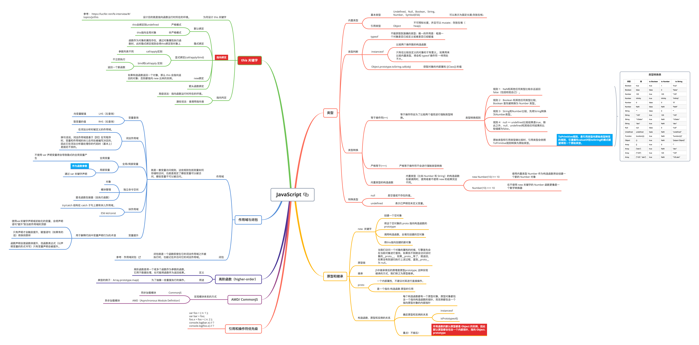
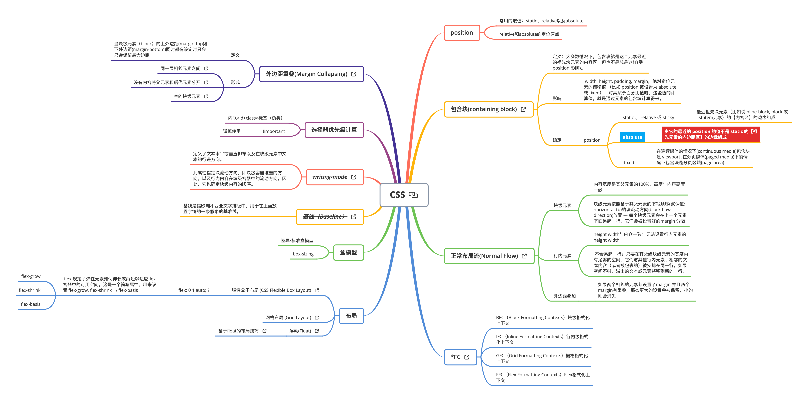
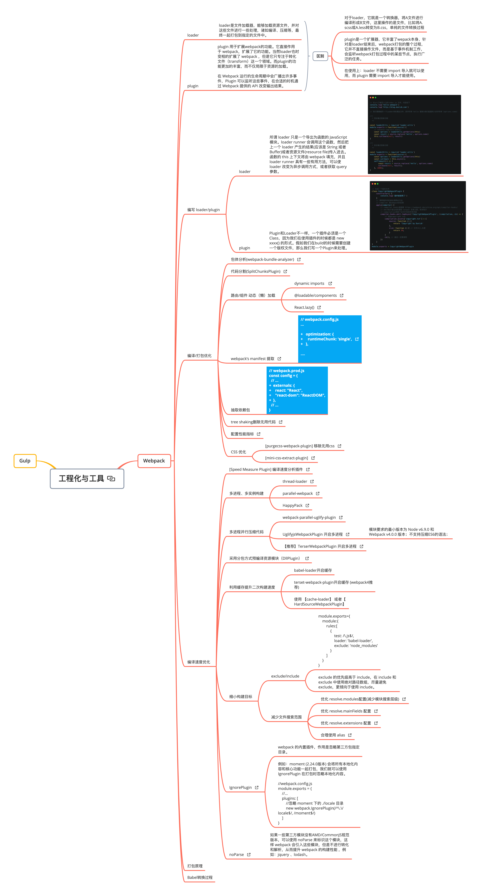

> 一份详细的前端基础知识思维导图。

####  在线查看 [点这里](https://mm.liayal.com)

## ⏬ 下载
<a href="https://mm.liayal.com/FE-BK-Mind-Map-2021-03-20.xmind?attname=FE-BK-Mind-Map.xmind" target="_blank" rel="noopener" download="FE-BK-Mind-Map.xmind">FE-BK-Mind-Map Xmind下载</a>

 

## 🚦 最后
如果您认为思维导图中有任何需要改进的地方，请随时在issues中进行讨论。   
另外，我会持续的新增一些知识点，因此您可以 watch 这个仓库。

## License

FE-BK-Mind-Map is open source [licensed as MIT](https://github.com/facebook/create-react-app/blob/master/LICENSE).
